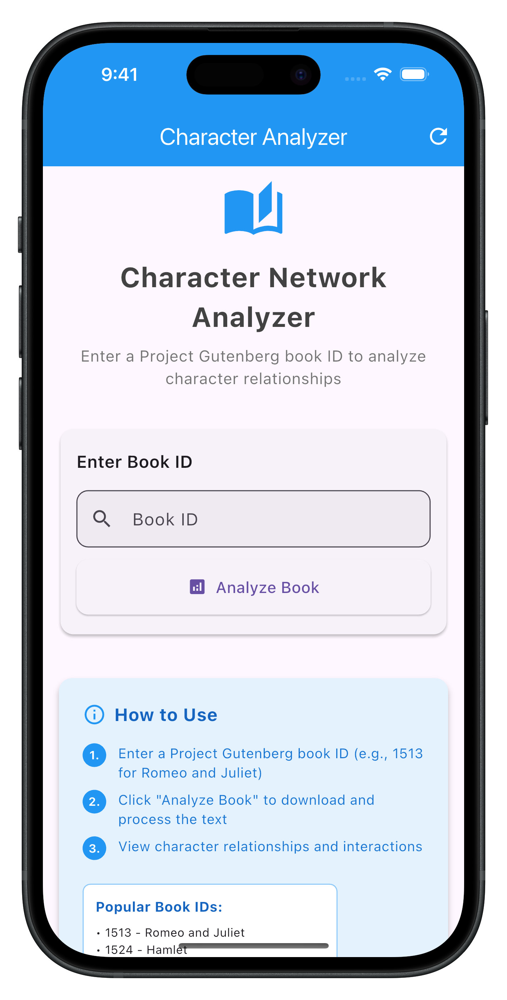
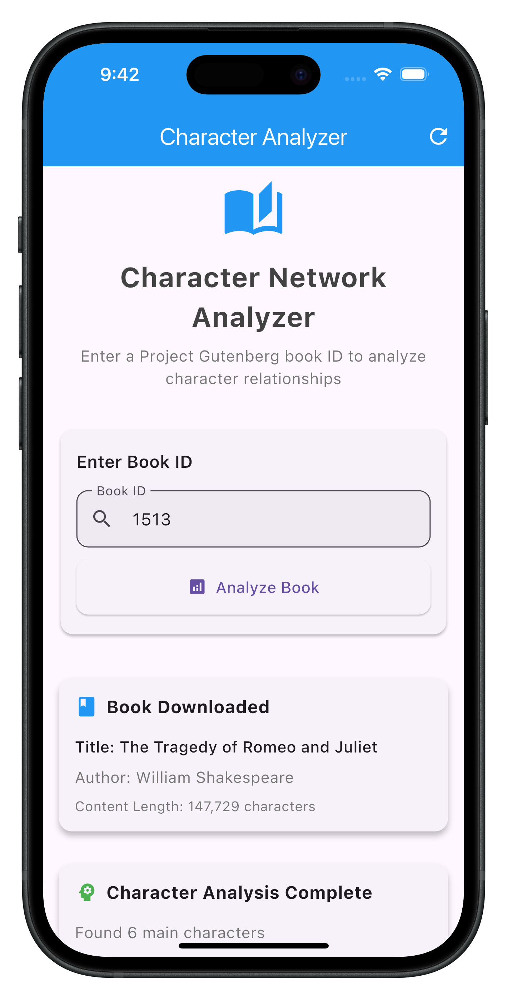
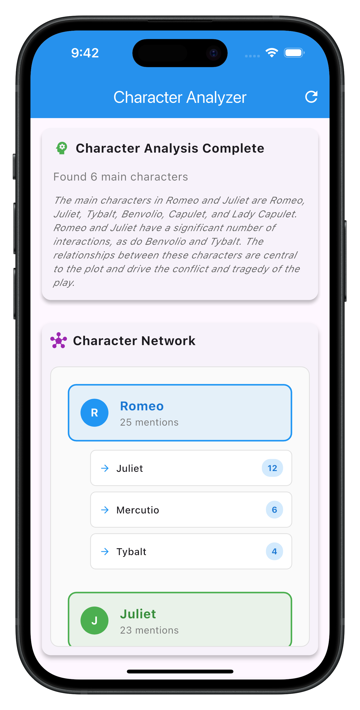
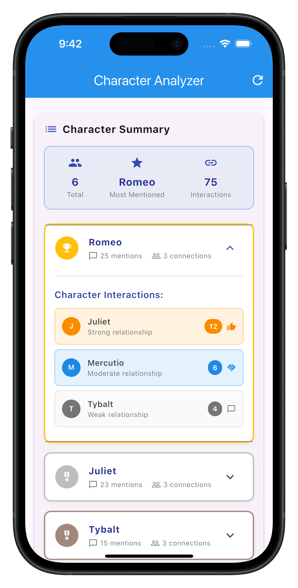

# 📚 Guten Read - Book Analysis with AI

A Flutter application that analyzes books from Project Gutenberg to extract and get character relationships using AI.

## Features

- **Book Download**: Fetch any public domain book from Project Gutenberg using its ID
- **AI-Powered Analysis**: Utilizes Groq AI to analyze character relationships and interactions
- **Interactive Visualization**: View character networks and interactions
- **Clean Architecture**: Follows clean architecture principles for maintainability

## Getting Started

### Prerequisites

- Flutter SDK (latest stable version)
- Dart SDK (compatible with your Flutter version)
- Groq API key (for AI analysis)

### Installation

1. Clone the repository:
   ```bash
   git clone https://github.com/iqbaltld/guten_read.git
   cd guten_read
   ```

2. Install dependencies:
   ```bash
   flutter pub get
   ```

3. Set up environment variables:
   - Create a `.env` file in the root directory
   - Add your Groq API key:
     ```
     GROQ_API_KEY=your_groq_api_key_here
     ```
   - **Important**: The `.env` file is in `.gitignore` for security. Never commit your API key to version control.

4. Run the app:
   ```bash
   flutter run
   ```

## Project Structure

```
lib/
├── core/
│   ├── constants/     # App-wide constants
│   ├── network/       # Network layer (Api Manager, interceptors, error handling)
│   ├── routes/        # App routing configuration
│   └── utils/         # Utility functions
│
├── features/
│   └── book_analyzer/ # Book analysis feature module
│       ├── data/      # Data layer
│       │   ├── datasources/  # Remote data sources
│       │   ├── models/      # Data transfer objects (DTOs)
│       │   └── repositories/ # Repository implementations
│       │
│       ├── domain/    # Domain layer
│       │   ├── entities/    # Core business objects
│       │   ├── repositories/ # Abstract repository contracts
│       │   └── usecases/    # Application-specific business rules
│       │
│       └── presentation/     # UI layer
│           ├── cubit/       # State management logic
│           ├── pages/       # Application screens
│           └── widgets/     # Reusable UI components
│
├── injection_container.dart  # Dependency injection setup
└── main.dart                # Application entry point
```

## Dependencies

- **State Management**: `flutter_bloc` with `equatable`
- **Dependency Injection**: `get_it` with `injectable`
- **Networking**: `dio` for HTTP requests
- **UI**: `flutter_screenutil` for responsive design
- **Utilities**: 
  - `dartz` for functional programming
  - `intl` for internationalization
  - `url_launcher` for opening external links
  - `connectivity_plus` for network status
  - `flutter_dotenv` for environment variables

## How It Works

1. **Book Download**: The app fetches the full text of a book from Project Gutenberg using the provided book ID.
2. **Text Processing**: The book content is cleaned and prepared for analysis.
3. **AI Analysis**: The text is sent to the Groq AI service to analyze character relationships and interactions.
4. **Visualization**: Results are presented through a detailed character list.

## Usage

1. Launch the application
2. Enter a valid Project Gutenberg book ID (e.g., `1513`)
3. Tap "Analyze" to begin the download and analysis process
4. View the character network visualization
5. Explore detailed character relationships and interaction frequencies

## Screenshots

<p align="center">
  
  
  
  
</p>


## Author

**Muhammed Iqbal** – [LinkedIn](https://linkedin.com/in/iqbaltld)  